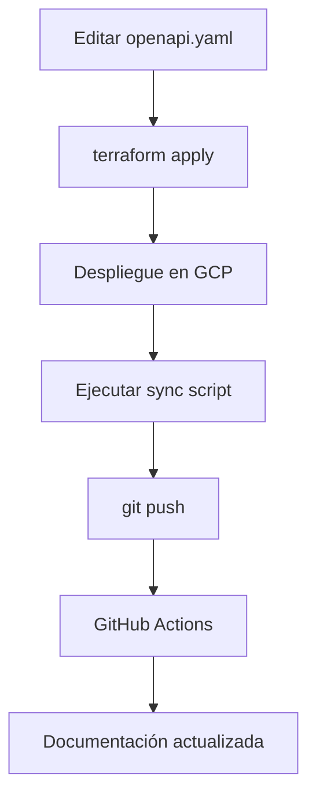

# Google Cloud API ```
# Google Cloud API Gateway - Allygo Microservices

Infraestructura como código (Terraform) para desplegar un **Google Cloud API Gateway** como punto de entrada unificado para los microservicios de Allygo.

> 📖 **[Ver Índice Completo de Documentación](INDEX.md)** - Navegación rápida a todos los recursos

---

## 📑 Tabla de Contenidos

- **🚀 [Quick Start](#-configuración-inicial)** - Comenzar rápidamente
- **🏗️ [ARCHITECTURE.md](ARCHITECTURE.md)** - Arquitectura técnica detallada
- **🔄 [WORKFLOW.md](WORKFLOW.md)** - Flujo de trabajo con OpenAPI
- **⚡ [CHEATSHEET.md](CHEATSHEET.md)** - Comandos rápidos
- **☁️ [CLOUD_RUN.md](CLOUD_RUN.md)** - Integración con Cloud Run
- **🌐 [docs/SETUP.md](docs/SETUP.md)** - Configurar GitHub Pages

---

## 📋 Descripción General

Esta configuración crea un **API Gateway nativo de GCP** que:
- ✅ Enruta tráfico HTTP/HTTPS a múltiples microservicios
- ✅ Proporciona una URL única y segura (HTTPS automático)
- ✅ Soporta autenticación, autorización y rate limiting
- ✅ Gestión de API versionada con OpenAPI 2.0
- ✅ Integración con Cloud Run, GKE o cualquier backend HTTP

---

## 🏗️ Arquitectura

```
┌─────────────────────────────────────────────────────────┐
│  Cliente                                                │
│  https://allygo-xxxxx.apigateway.us-central1.gateway.dev│
└────────────────────┬────────────────────────────────────┘
                     │
                     ▼
┌─────────────────────────────────────────────────────────┐
│  Google Cloud API Gateway                               │
│  - Routing (OpenAPI spec)                               │
│  - Authentication (API Keys, OAuth, JWT)                │
│  - Rate Limiting & Quotas                               │
│  - CORS, SSL/TLS                                        │
└────────────────────┬────────────────────────────────────┘
                     │
         ┌───────────┼───────────┐
         ▼           ▼           ▼
    ┌────────┐  ┌────────┐  ┌────────┐
    │Payments│  │ Users  │  │ Orders │
    │   MS   │  │   MS   │  │   MS   │
    │ (GKE)  │  │ (GKE)  │  │ (GKE)  │
    └────────┘  └────────┘  └────────┘
```

---

## 📁 Estructura de Archivos

```
api-gateway/
├── main.tf                    # Recursos principales (API Gateway, API Config, Gateway)
├── variables.tf               # Variables de entrada
├── outputs.tf                 # Outputs (URL, IP, etc.)
├── openapi.yaml              # OpenAPI con variables de Terraform (FUENTE DE VERDAD)
├── terraform.tfvars           # Tu configuración (git-ignored)
├── terraform.tfvars.example  # Ejemplo de configuración
├── sync-openapi.py           # Script Python para sincronizar docs
├── sync-openapi.ps1          # Script PowerShell para sincronizar docs
├── CLOUD_RUN.md              # Guía de integración con Cloud Run
├── docs/                     # Documentación GitHub Pages
│   ├── index.html            # Página Swagger UI
│   ├── openapi.yaml          # OpenAPI estático (AUTO-GENERADO)
│   ├── README.md             # Documentación del sitio
│   └── SETUP.md              # Guía de configuración
└── README.md                 # Este archivo
```

### 🔄 Dos Archivos OpenAPI Explicados

#### **`openapi.yaml`** (Raíz del proyecto)
- **Propósito:** Configuración de Terraform
- **Contiene:** Variables de Terraform (`${services_management_url}`)
- **Usado por:** Terraform para desplegar el API Gateway
- **✏️ Edita este archivo** cuando agregues/cambies endpoints

#### **`docs/openapi.yaml`** (Carpeta docs)
- **Propósito:** Documentación pública (GitHub Pages)
- **Contiene:** Valores estáticos para mostrar en Swagger UI
- **Usado por:** Swagger UI en la página de documentación
- **❌ NO edites este archivo** - Se auto-genera con los scripts de sync

---

## 🚀 Configuración Inicial

### 🎯 Quick Start (Comandos Rápidos)

Ver [CHEATSHEET.md](CHEATSHEET.md) para comandos comunes.

### 1. Copiar archivo de variables

```powershell
Copy-Item terraform.tfvars.example terraform.tfvars
```

### 2. Editar `terraform.tfvars`

```hcl
# Proyecto GCP
project_id = "allygo"
region     = "us-east1"

# Nombre del API Gateway
api_gateway_name = "allygo-api-gateway"

# URLs de los microservicios backend
# Para GKE: http://service-name.namespace.svc.cluster.local
# Para Cloud Run: https://service-xxxxx-uc.a.run.app
payments_service_url = "http://payments-ms.default.svc.cluster.local"
users_service_url    = "http://users-ms.default.svc.cluster.local"
orders_service_url   = "http://orders-ms.default.svc.cluster.local"
```

### 3. Autenticar con GCP

```powershell
gcloud auth application-default login
```

### 4. Desplegar

```powershell
terraform init
terraform plan
terraform apply
```

---

## 🌐 Uso del API Gateway

### Obtener la URL del Gateway

```powershell
terraform output api_gateway_url
```

**Ejemplo de URL:**
```
allygo-api-gateway-xxxxx.uc.gateway.dev
```

### Probar endpoints

```bash
# Health check de Payments
curl https://allygo-api-gateway-xxxxx.uc.gateway.dev/api/payments/health

# Listar pagos
curl https://allygo-api-gateway-xxxxx.uc.gateway.dev/api/payments

# Obtener un pago específico
curl https://allygo-api-gateway-xxxxx.uc.gateway.dev/api/payments/123

# Crear un pago
curl -X POST https://allygo-api-gateway-xxxxx.uc.gateway.dev/api/payments \
  -H "Content-Type: application/json" \
  -d '{"amount": 100, "currency": "USD"}'
```

---

## 📝 Personalizar Rutas (OpenAPI)

El archivo `openapi.yaml` define todas las rutas y backends. Para agregar nuevos endpoints:

### Paso a Paso: Agregar un Nuevo Endpoint

#### 1. Edita `openapi.yaml`

```yaml
paths:
  /api/nuevo-servicio/health:
    get:
      summary: Health check
      operationId: nuevoServicioHealth
      x-google-backend:
        address: ${nuevo_servicio_url}/health
        protocol: h2
        jwt_audience: ${nuevo_servicio_url}
        deadline: 30.0
      responses:
        '200':
          description: OK
```

#### 2. Agrega la variable en `variables.tf`

```hcl
variable "nuevo_servicio_url" {
  description = "Backend URL for Nuevo Servicio"
  type        = string
}
```

#### 3. Actualiza `terraform.tfvars`

```hcl
nuevo_servicio_url = "https://nuevo-servicio-xxxxx.us-east1.run.app"
```

#### 4. Aplica los cambios

```powershell
terraform apply
```

#### 5. Sincroniza la documentación

```powershell
# Opción 1: PowerShell (recomendado en Windows)
.\sync-openapi.ps1

# Opción 2: Python (multi-plataforma)
python sync-openapi.py
```

#### 6. Sube los cambios a GitHub

```powershell
git add .
git commit -m "Agregar endpoint de nuevo servicio"
git push
```

**✨ GitHub Actions actualizará automáticamente la documentación en tu sitio.**

---

### 🤖 Sincronización Automática

Los scripts de sincronización (`sync-openapi.py` y `sync-openapi.ps1`) hacen lo siguiente:

1. ✅ Leen el archivo `openapi.yaml` (con variables de Terraform)
2. ✅ Reemplazan `${variable}` con valores de ejemplo
3. ✅ Eliminan secciones específicas de Terraform (`x-google-backend`)
4. ✅ Agregan tags y mejoras para documentación
5. ✅ Guardan el resultado en `docs/openapi.yaml`

**Nunca edites `docs/openapi.yaml` manualmente** - siempre será sobrescrito por los scripts.

---

## 🔐 Habilitar Autenticación (Opcional)

### API Key Authentication

Descomenta en `openapi.yaml`:

```yaml
securityDefinitions:
  api_key:
    type: "apiKey"
    name: "x-api-key"
    in: "header"
security:
  - api_key: []
```

Luego crea una API Key en GCP:

```bash
gcloud alpha services api-keys create \
  --display-name="Allygo API Key" \
  --api-target=service=allygo-api-gateway-xxxxx.apigateway.us-east1.gateway.dev
```

Usar con:

```bash
curl https://allygo-api-gateway-xxxxx.uc.gateway.dev/api/payments \
  -H "x-api-key: YOUR_API_KEY"
```

---

## 🆚 API Gateway vs Ingress (Kubernetes)

| Característica | API Gateway (GCP) | Ingress (Kubernetes) |
|---|---|---|
| **Gestión** | Managed service (GCP) | Self-managed (GKE) |
| **SSL/TLS** | Automático (Google-managed) | Automático con cert-manager |
| **Autenticación** | API Keys, OAuth, JWT integrado | Requiere extensiones (OAuth2 Proxy) |
| **Rate Limiting** | Nativo (quotas por API key) | Requiere plugins (NGINX) |
| **Backends** | GKE, Cloud Run, Cloud Functions, HTTP | Solo servicios en GKE |
| **Costo** | ~$3/millón requests + $0.20/GB | Incluido en GKE (~$18/mes LB) |
| **Versionado API** | Sí (via API configs) | No nativo |
| **Latencia** | Ligeramente mayor (hop extra) | Menor (dentro del cluster) |
| **Monitoreo** | Cloud Logging/Monitoring integrado | Requiere configuración |
| **CORS** | Configuración nativa | Annotations en Ingress |

---

## 💰 Estimación de Costos

### API Gateway
- **Llamadas API:** $3.00 por millón de llamadas
- **Datos transferidos:** $0.20 por GB
- **Sin costo base fijo**

**Ejemplo:** 1M requests/mes, 10GB datos = ~$5/mes

### Comparación con Ingress
- **Ingress (GKE):** ~$18/mes por Load Balancer + $0.008/GB
- **API Gateway:** ~$3-10/mes según uso (sin costo base)

---

## 📊 Outputs Disponibles

Después de `terraform apply`:

```powershell
# URL del API Gateway
terraform output api_gateway_url

# Service Account email
terraform output service_account_email

# IP estática (para dominio personalizado)
terraform output static_ip

# Comando de prueba
terraform output example_curl_command
```

---

## 🔧 Configuración de Dominio Personalizado

### 1. Obtener la IP estática

```powershell
terraform output static_ip
```

### 2. Crear registro DNS

En tu proveedor de DNS (GoDaddy, Namecheap, etc.):

```
Tipo: A
Nombre: api.allygo.com
Valor: <IP_DEL_OUTPUT>
TTL: 3600
```

### 3. Configurar en API Gateway

Agrega en `main.tf`:

```hcl
resource "google_api_gateway_gateway" "gateway" {
  # ... configuración existente ...
  
  # Agregar dominio personalizado
  display_name = "api.allygo.com"
}
```

---

## 🧪 Testing

### Verificar que el API Gateway está activo

```bash
gcloud api-gateway gateways describe allygo-api-gateway \
  --location=us-east1 \
  --project=allygo
```

### Ver logs de peticiones

```bash
gcloud logging read "resource.type=api AND resource.labels.service=allygo-api-gateway" \
  --limit 50 \
  --format json
```

### Métricas en Cloud Console

https://console.cloud.google.com/api-gateway/api/allygo-api-gateway

---

## 🛠️ Troubleshooting

### Error: "backends must be defined"

**Causa:** La URL del backend en `terraform.tfvars` está vacía.

**Solución:** Configura `payments_service_url` con la URL correcta del servicio.

---

### Error: "Service account does not have permission"

**Causa:** El service account no puede invocar el backend.

**Solución:** Agrega permisos:

```bash
gcloud run services add-iam-policy-binding payments-ms \
  --member="serviceAccount:terraform-gcp@allygo.iam.gserviceaccount.com" \
  --role="roles/run.invoker"
```

---

### 502 Bad Gateway

**Causa:** El backend no es accesible desde API Gateway.

**Solución:** 
- Para GKE: Asegúrate de que el servicio es tipo `ClusterIP` y está en la misma VPC
- Para Cloud Run: Verifica que el servicio está desplegado y es accesible

---

## 📚 Recursos Adicionales

- **📖 [Flujo de Trabajo Detallado](WORKFLOW.md)** - Cómo funcionan los dos archivos OpenAPI
- **☁️ [Cloud Run Integration](CLOUD_RUN.md)** - Integración con Cloud Run
- **🌐 [GitHub Pages Setup](docs/SETUP.md)** - Configurar documentación
- **📝 [Documentación del Sitio](docs/README.md)** - README de la documentación
- [GCP API Gateway Documentation](https://cloud.google.com/api-gateway/docs)
- [OpenAPI 2.0 Specification](https://swagger.io/specification/v2/)
- [API Gateway Pricing](https://cloud.google.com/api-gateway/pricing)
- [Best Practices for API Design](https://cloud.google.com/apis/design)

---

## 🔄 Actualizar la Configuración

### Flujo Completo de Actualización



#### Escenario 1: Cambiar un Endpoint Existente

1. **Edita `openapi.yaml`** - Modifica el endpoint
2. **Aplica cambios:** `terraform apply`
3. **Sincroniza docs:** `.\sync-openapi.ps1`
4. **Sube a GitHub:** `git push`
5. ✅ API Gateway actualizado sin downtime
6. ✅ Documentación actualizada automáticamente

#### Escenario 2: Cambiar URL de Backend

1. **Edita `terraform.tfvars`:**
   ```hcl
   services_management_service_url = "https://new-url.run.app"
   ```
2. **Aplica:** `terraform apply`
3. ✅ El API Gateway apuntará al nuevo backend

#### Escenario 3: Solo Actualizar Documentación

1. **Edita descripciones en `openapi.yaml`**
2. **Sincroniza:** `.\sync-openapi.ps1`
3. **Sube:** `git push`
4. ✅ Documentación actualizada (sin afectar infraestructura)

**⚡ Tip:** API Gateway usa versionado automático, por lo que los cambios se aplican sin downtime.

---

## 🗑️ Destruir la Infraestructura

```powershell
terraform destroy
```

**⚠️ Advertencia:** Esto eliminará el API Gateway y todas sus configuraciones.

---

## 📞 Soporte

Para problemas o preguntas, contacta al equipo de infraestructura de Allygo.
